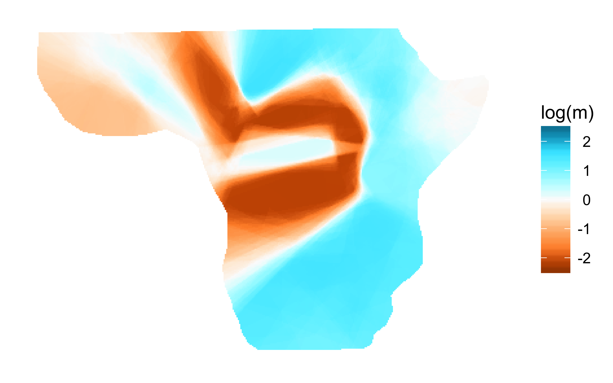
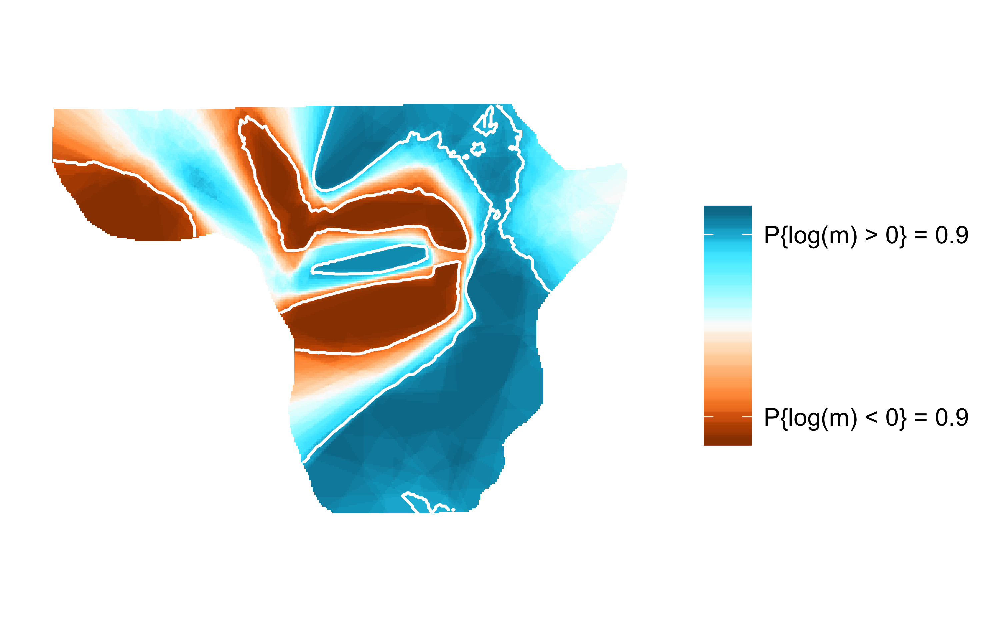
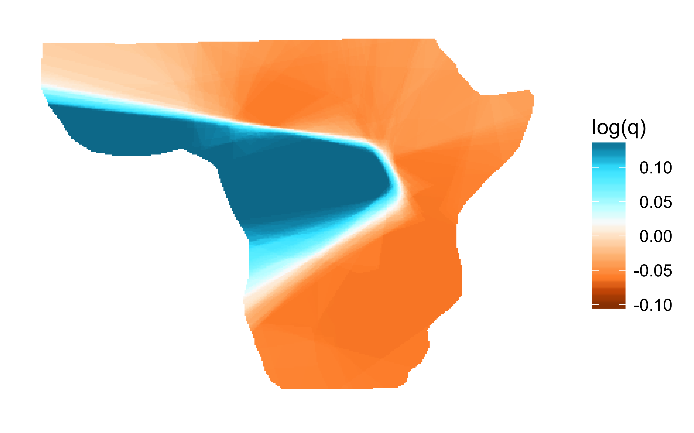
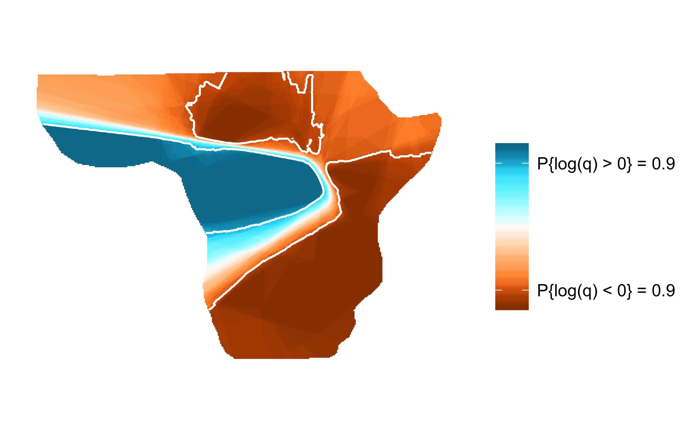
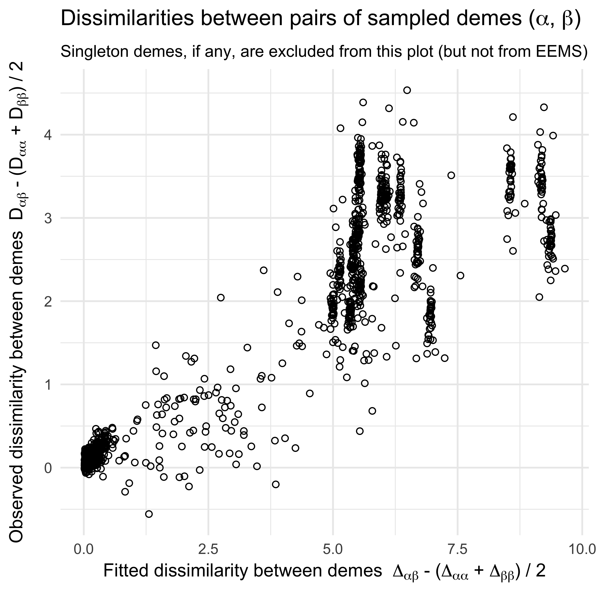
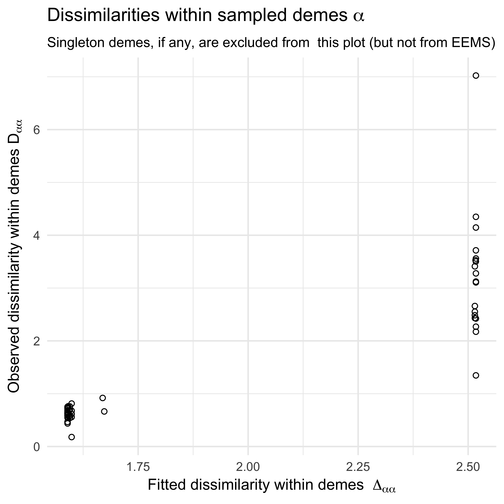
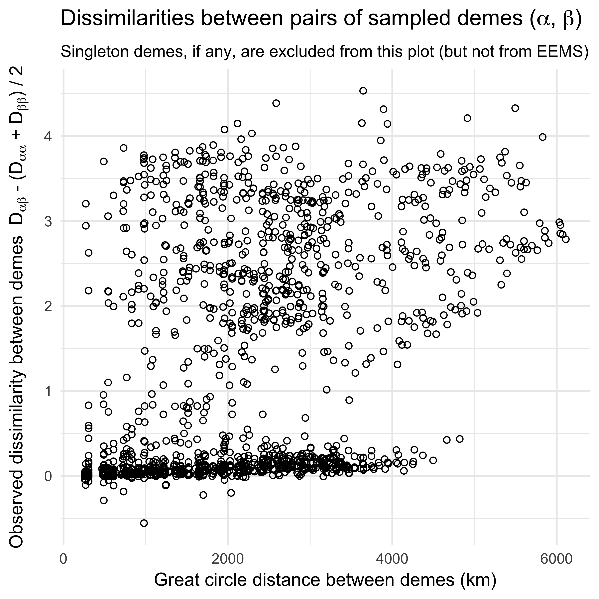
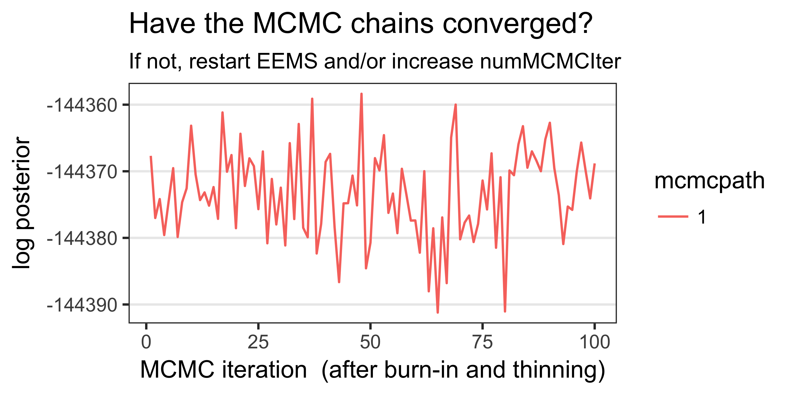

[](http://www.repostatus.org/#active) [](https://travis-ci.org/dipetkov/reemsplots2) [](https://ci.appveyor.com/project/dipetkov/reemsplots2)

------------------------------------------------------------------------

[](https://cran.r-project.org/) [](https://cran.r-project.org/package=reemsplots2) [](commits/master)

------------------------------------------------------------------------

[](/commits/master)

<!-- README.md is generated from README.Rmd. Please edit that file -->
### reemsplots2: Generate plots to inspect and visualize the results of EEMS

### Installation

``` r
library("devtools")
install_github("dipetkov/reemsplots2")
```

Now, with the function `make_eems_plots`, we can produce a set of several figures to visualize the results of analyzing geo-referenced genetic data with EEMS as well as to evaluate the EEMS model fit.

``` r
library("reemsplots2")
mcmcpath <- system.file("extdata", "EEMS-example", package = "reemsplots2")
plots <- make_eems_plots(mcmcpath, longlat = TRUE)
#> Joining, by = "id"
#> Generate effective migration surface (posterior mean of m rates). See plots$mrates01 and plots$mrates02.
#> Generate effective diversity surface (posterior mean of q rates). See plots$qrates01 and plots$qrates02.
#> Generate average dissimilarities within and between demes. See plots$rdist01, plots$rdist02 and plots$rdist03.
#> Generate posterior probability trace. See plots$pilog01.
names(plots)
#> [1] "mrates01" "mrates02" "qrates01" "qrates02" "rdist01"  "rdist02" 
#> [7] "rdist03"  "pilogl01"
```

``` r
plots$mrates01
```



``` r
plots$mrates02
```



``` r
plots$qrates01
```



``` r
plots$qrates02
```



``` r
plots$rdist01
```



``` r
plots$rdist02
```



``` r
plots$rdist03
```



``` r
plots$pilogl01
```


